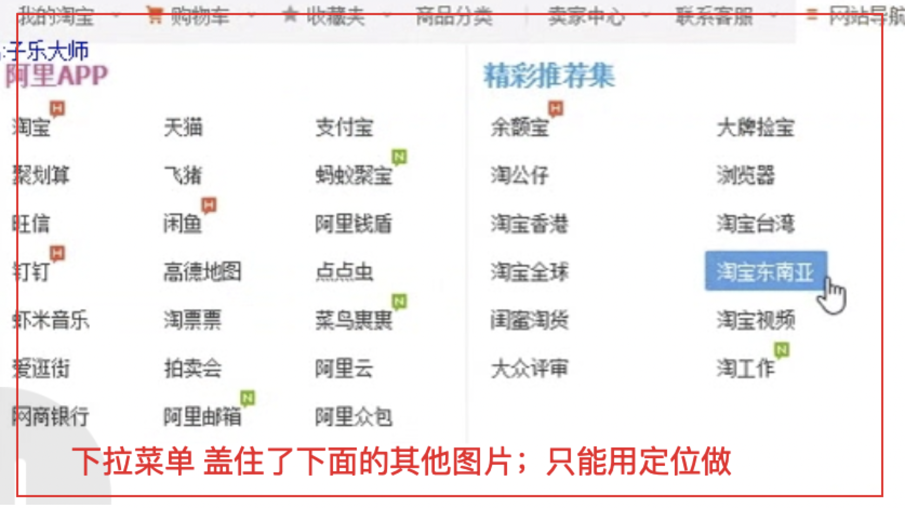

# 定位

- 定义：定位的目的是移动位置，让盒子到指定位置去
- 定位：定位=边偏移+定位模式

## 1 边偏移属性

- top：顶端偏移量，定义元素相对于其父元素上边线的距离
- bottom：底端偏移量，
- left：左端偏移量
- right：右端偏移量

* 备注： 边偏移需要和定位搭配使用，否则边偏移无效。和默认定位 static 搭配也是无效

## 2 四种定位模式

> 定位口诀：子绝父相（父亲采用相对定位，孩子采用绝对定位）

### 2.1 `position: static;`
  - 默认定位 (静态定位对边偏移无效)
  - 一般采用静态定位给定位的盒子清除定位
```css
/* 示例1：静态定位： */
.box1 {
  width: 100px;
  height: 100px;
  background-color: pink;
  position: static;
  left: 200px;
  top: 200px;
}
```
### 2.2 `position: relative;`
  - 相对定位
  - 原点选择：以之前的位置的左上角为原点，开始偏移（相对于之前的自己开始移动）
  - 可以通过边偏移移动位置，但是之前的位置仍然保留
```html
<!-- 示例1：相对定位 -->
<style>
    .box1 {
        width: 100px;
        height: 200px;
        background-color: pink;
    }
    .box2 {
        width: 100px;
        height: 200px;
        background-color: blue;
        /* 以box2左上角为原点开始偏移；并且保留box2未偏移之前的位置 */
        position: relative;
        top: 20px;
        left: 50px;
    }
    .box3 {
        width: 100px;
        height: 200px;
        background-color: skyblue;
    }
</style>
<div class="box1"></div>
<div class="box2"></div>
<div class="box3"></div>
```
### 2.3 `position: absolute;`
  - 绝对定位
  - 脱离标准流，浮动起来；并且不占有文档流位置
  - 原点选择：
    - 父元素或者祖先元素中没有采用定位(相对定位 | 绝对定位 | 固定定位), 则以 body 浏览器为原点
    - 若父元素或者祖先中有定位(相对定位 |绝对定位 |固定定位), 孩子的绝对定位则根据最近的有定位的父亲为原点
```html
<!-- 示例1：absolute：脱离文档流  -->
<style>
    .box1 {
        width: 50px;
        height: 50px;
        background-color: pink;
        top: 20px;
        left: 20px;
        /* 采用绝对定位，会浮动脱离文档流 */
        position: absolute;
    }
    .box2 {
        width: 100px;
        height: 200px;
        background-color: blue;
    }
</style>
<div class="box1"></div>
<div class="box2"></div>
```

```html
<!-- 示例1：绝对定位父元素没有定位，子元素以浏览器为原点偏移 -->
<style>
    .father {
        width: 200px;
        height: 200px;
        background-color: pink;
        margin: 100px;
    }
    .son {
        width: 100px;
        height: 100px;
        left: 50px;
        top: 50px;
        position: absolute;
        background-color: blue;
    }
</style>
<div class="father">
    <div class="son"></div>
</div>

<!-- 示例2：绝对定位父元素有定位，子元素以父元素为原点偏移 -->
<style>
    .father {
    width: 200px;
    height: 200px;
    background-color: pink;
    position: relative;
    top: 50px;
    left: 50px;
    }
    /* son说明父元素有定位时，son偏移原点以父元素为基准 */
    .son {
    width: 100px;
    height: 100px;
    left: 50px;
    top: 50px;
    position: absolute;
    background-color: blue;
    }
    /* son2说明son元素浮动了 */
    .son2 {
    width: 70px;
    height: 70px;
    background: indianred;
    }
</style>
<div class="father">
    <div class="son"></div>
    <div class="son2"></div>
</div>
```

### 2.4 `position: fixed;`
  - 固定定位 以浏览器窗口左上角为原点
  - 相对浏览器窗口进行定位,因此当滚动产生时，固定定位元素依然处于窗口的某个固定位置

## 3 绝对定位水平居中问题
+ `margin:0 auto;` 只能让`标准流`的盒子居中对齐，但是加了绝对定位的盒子margin-auto水平居中无效
+ 定位盒子水平垂直居中算法：
```js
1. 首先left 50% 父盒子的一半大小
2. 然后走自己盒子外边距负的一半值 margin-left
```
```html
<!-- 示例1： -->
<!--
// 定位盒子水平居中
// 垂直居中和盒子整体居中都是同理
-->
<!DOCTYPE html>
<html lang="en">
<head>
    <meta charset="UTF-8">
    <title>定位盒子水平居中</title>
    <style>
        .father {
            width: 800px;
            height: 400px;
            background-color: black;
            margin: 50px auto;
            position: relative;
        }
        .son {
            width: 100px;
            height: 100px;
            background-color: blue;
            position: absolute;
            /* left: 50%  也可以 这里的400px是父盒子宽度的一半 */
            left: 400px;            /* 先走父盒子宽度的一半 */
            margin-left: -50px;     /* 再走子盒子外边距的负一半 */
        }
    </style>
</head>
<body>
    <div class="father">
        <div class="son">
        </div>
    </div>
</body>
</html>
```

## 4 定位应用场景
+ 场景1：

+ 场景2：
