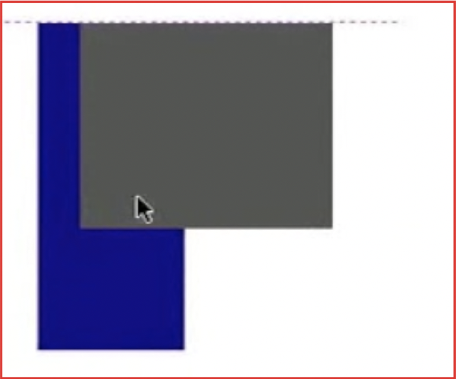
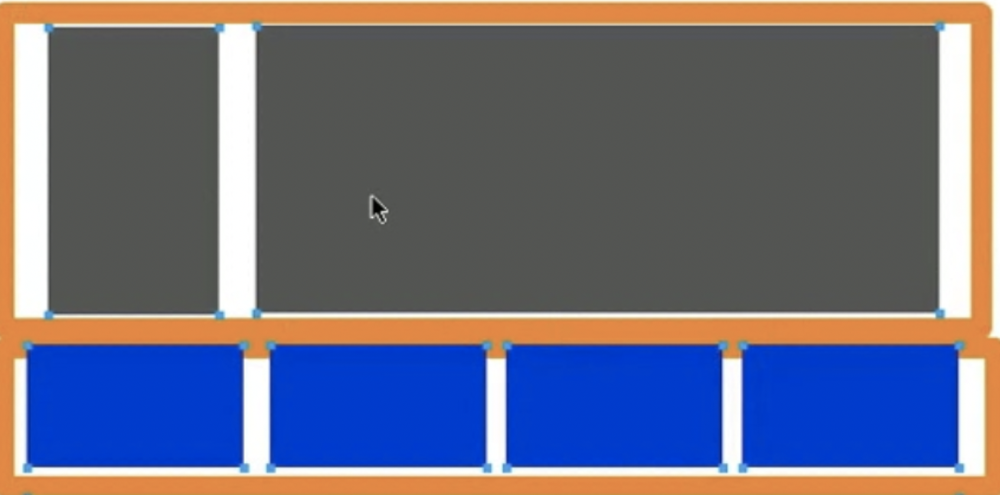
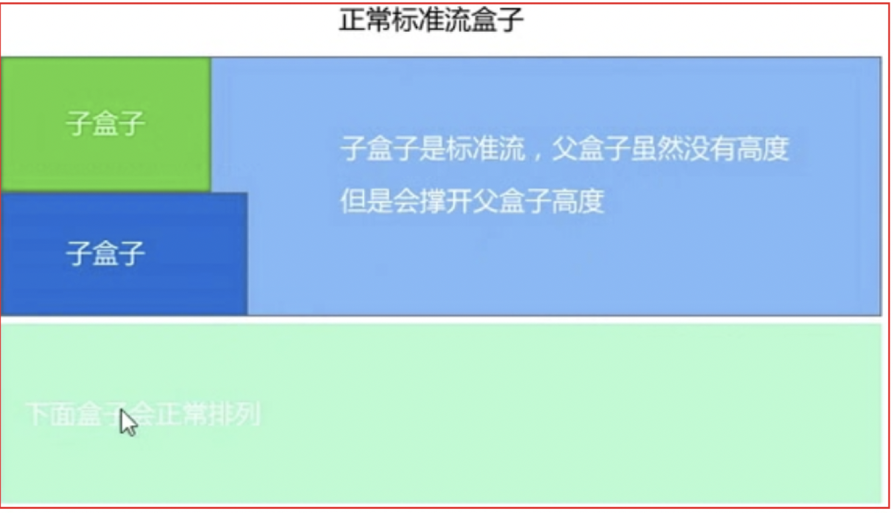
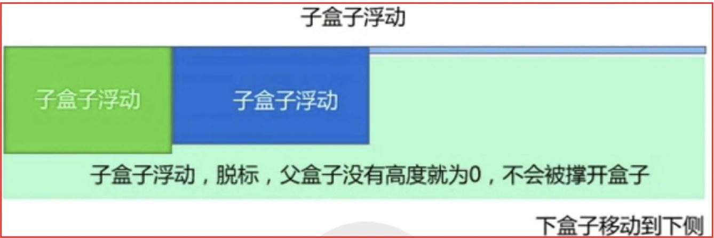
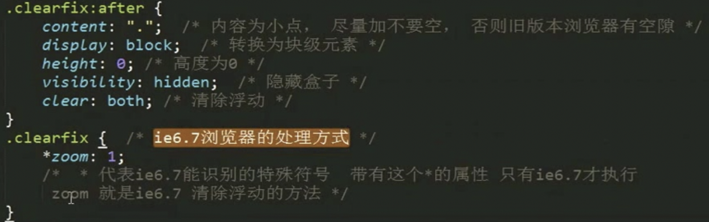
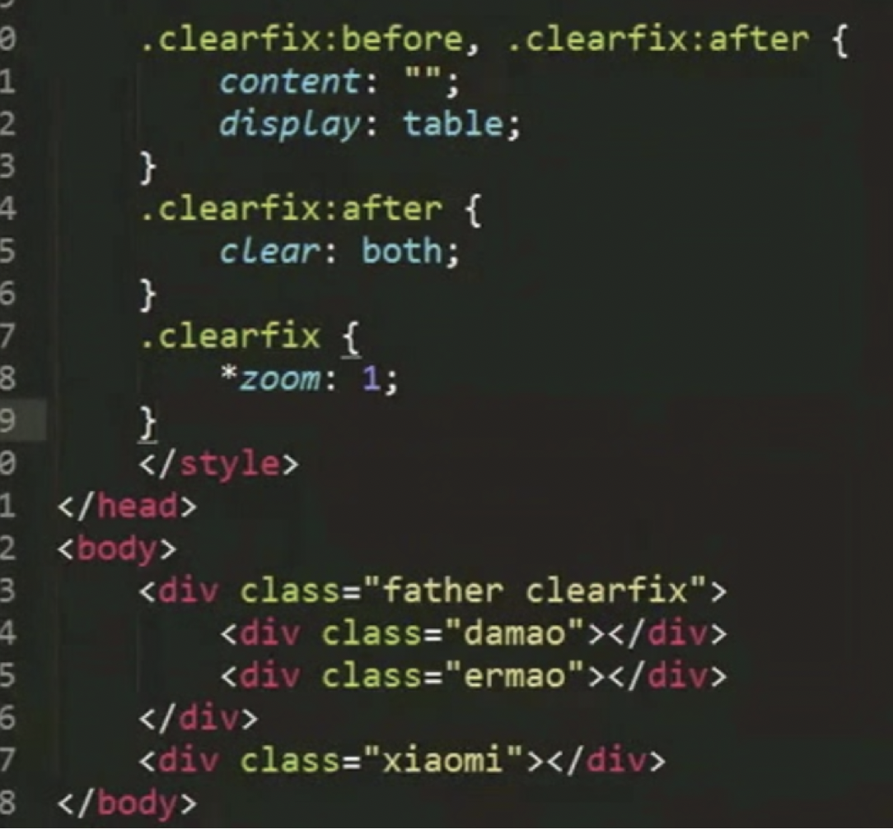

# 0 普通流
+ 定义：指我们块元素默认从上向下摆放，行级元素默认从左向右摆放，这些都称为普通流或者标准流布局
# 1 浮动
## 1.1 起源
+ float属性最初被引入用来实现图片被文字围绕的效果，类似报纸中的一篇图文报道

## 1.2 目前作用
+ 1. 作用1：做文字图片环绕效果
+ 2. 作用2或者主要目的：浮动使得块元素可以水平布局

## 1.3 浮动背景
+ 1. 没有浮动之前，让块元素水平排列方法是采用display: inline-block;转换为行内块元素就可以放在一行了；但是这种方式缺点是元素之前有空隙，不方便处理
+ 2. 有了浮动之后，浮动之后的元素之间没有空隙

## 1.4 浮动定义
+ 定义：元素的浮动指设置了浮动属性的元素会脱离标准流的控制，移动到其父亲元素中指定位置的过程
+ 语法：`float: 属性值`

属性值 | 描述
---|---
left  | 元素向左浮动
right | 元素向右浮动
none  | 元素不浮动（默认值）
## 1.5 浮动理解
+ 下图对上面的灰色div设置了靠左浮动，这时候div元素在3维空间漂浮在上层，然后下面的蓝色div还在最下层就占据了最下层之前灰色div的位置；这时候就重叠了

+ 浮动叠加，解决这个问题就需要一个大盒子占位置防止浮动之后下面会占位置导致重叠


## 1.6 浮动内幕
- 脱离标准流、不占位置（因为漂浮起来了）、会影响标准流、浮动只有左右浮动
- 浮动首先需要创建大盒子包裹元素，浮动的元素总是找理他最近的元素对齐，但不会超出内边距的范围
- 当都需要在同一行展示时，则都需要浮动
- 浮动元素排列位置（假如A块和B块上下排列）：
  - 当A和B两个都浮动时；左右排列两个盒子的顶部对齐
  - 当只有A盒子浮动时，B会上移，导致两个盒子重叠
  - 当只有B盒子浮动时，B在原来的位置从标准层1层跑到浮动层2层


# 2 清除浮动
## 2.1  清除浮动的背景
+ 不给外裹的父盒子高度时，子盒子的高度会撑开父盒子，导致父盒子有高度；但是子盒子浮动后，父盒子高度消失，此时父盒子下面的盒子就会顶上来。

## 2.2 清除浮动的本质
+ 主要解决父元素没有设置高度时因为子元素的浮动而导致父元素的内部高度从撑开变为0的问题
+ 因为很多情况下不方便给父亲高度（比如新闻模块）



## 2.3 清除浮动的方法（4种）

### 2.3.1 额外标签法（W3C推荐的做法）
+ `{clear: both}`
+ 做法是在浮动的盒子后面增加一个空盒子

属性值 | 描述
---|---
left | 清除左边浮动影响
right | 清除右边浮动影响
both | 清除两边浮动影响

```html
<!-- 示例1： -->
<!DOCTYPE html>
<html lang="en">
<head>
    <meta charset="UTF-8">
    <meta name="viewport" content="width=device-width, initial-scale=1.0">
    <meta http-equiv="X-UA-Compatible" content="ie=edge">
    <title>Document</title>
    <style type="text/css">
        .father {
            background-color: pink;
            border: solid 2px skyblue;
        }
        .son2 {
            width: 100px;
            height: 200px;
            background-color: black;
            float: left;
        }
        .son1 {
            width: 100px;
            height: 200px;
            background-color: blue;
            float: left;
        }
        .uncle {
            height: 100px;
            background-color: red;
        }
        .son3 {
            clear: both;
        }
    </style>
</head>
<body>
    <div class="father">
        <div class="son1"></div>
        <div class="son2"></div>
        <div class="son3"></div>
    </div>
    <div class="uncle">
    </div>
</body>
</html>
```

### 2.3.2 父级添加overflow属性方法
+ 父元素添加 `{ overflow: hidden }`
+ overflow触发BFC清除浮动；overflow需要添加在父元素中；
+ overflow的可选值：hidden、auto、scroll都可以实现清除浮动
```html
<!-- 示例1： -->
<div class="links">
  <a href="#" class="forget">忘了密码？</a>
  <a href="#" class="register">注册新账号</a>
</div>
.links { overflow: hidden; }
.links .forget { float: left; }
.links .register { float: right; }
```
### 2.3.3 使用after伪元素清除浮动
+ after是空元素的升级版
+ 好处：不用再额外增加标签了
+ 缺点ie6-7不支持


```html
<!-- 示例1： -->
 <div class="father clearfix">
        <div class="son1"></div>
        <div class="son2"></div>
        <div class="son3"></div>
 </div>
```

### 2.3.4 使用before和after双伪元素清除浮动



# 浮动总结
```js
// 浮动：脱离文档流
float: right | left | none;

// 清除浮动
clear: left | right | both

// 浮动塌陷：父元素没有设置高度时，子元素都浮动，此时父元素的高度就为0了，因为没有子元素撑开高度（如果手动设置父元素高度就不会存在这种问题了）

// 解决浮动塌陷问题
1. 新增加个子元素 div  clear: both
2. 给父元素增加(原理跟1一样)  .clearfix::after{
    content: '',
    // 因为默认的伪元素是行元素
    display: block,
    clear: both
}
3. 给父元素增加(溢出隐藏) overflow: hidden  //（原理：因为overflow: hidden触发BFC规则，bfc去渲染页面时浮动的元素也参与计算高度）
4. 手动给父元素设置高度
```


