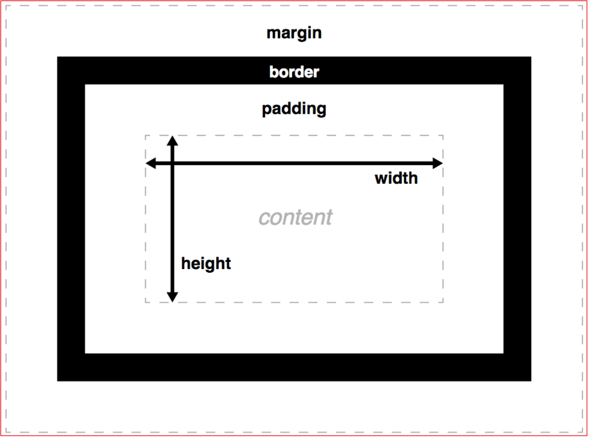

> CSS标准盒模型大小默认是`content+padding+border`；(CSS3中可以使用box-size设置)


# 0 盒模型基础属性
+ width
    - min-width
    - max-width
+ height
    - min-height
    - max-height
+ padding
    - padding-top
    - padding-right
    - padding-bottom
    - padding-left
+ border
    - border-top
    - border-right
    - border-bottom
    - border-left
+ margin
    - margin-top
    - margin-right
    - margin-bottom
    - margin-left

# 1 内边距
+ padding: 内边距（简写顺时针）
```html
<style type="text/css">
  div {
    width: 100px;
    height: 100px;
    border: 10px solid red;
    /*内容距离上边框10px*/
    padding-top: 10px;
    /*如果只写一个值，上下左右都是20px*/
    padding: 20px;
    /*padding两个值，表示上下10px，左右30px*/
    padding: 10px 30px;
    /*表示上10，左右30，下50*/
    padding: 10px 30px 50px;
    /*简写表示：顺时针，上右下左*/
    padding: 10px 20px 30px 40px;
  }
</style>
```
# 2 外边距
+ margin: 外边距（使用和内边距相似）

# 3. 问题类
## 3.1 背景图片和图片
+ 使用场景
    - 产品展示用插入图片
    - 背景图片适合做一些小图标
```html
<!-- 混淆1：文字水平居中和盒子水平居中的区别 -->
div {
            width: 100px;
            height: 100px;
            text-align: center; /*文字水平居中*/
            margin: 10px auto;  /*盒子水平居中*/
    }

<!-- 混淆2：插入图片和背景图片的区别（简单说插入的img其实是个盒子） -->
    <style type="text/css">
        section img {
            /*插入的图片会把文字挤到一遍*/
            width: 10px;
            height: 20px;       /*插入图片的大小通过width和height调控*/
            margin: 10px 20px;  /*插入图片的位置通过margin调控*/
        }
        aside {
            /*注意背景图片不影响块上面字的显示*/
            width: 400px;
            height: 400px;
            border: 1px solid red;
            background: #fff url("./Snipaste_2019-08-24_21-08-56.png") no-repeat;
            background-size: 200px 200px; /*背景图片更改大小 只能用background-size不能用width和height*/
            background-position: 30px 50px;  /*背景图片更改位置只能用 background-position*/
        }
    </style>
```
## 3.2 清除内外边距
+ 因为浏览器有默认的margin是8px，并且各个浏览器的默认都不一样，故我们需要全部清楚默认的内外边距样式
+ 行内元素只有左右内外边距，没有上下内外边距，所以行内元素只需要指定左右内外边距
```css
/* //清除默认内外边距样式 */
* {
    padding: 0px,
    margin: 0px
}
/* //经常采用 */
div,h1,h2,h3,h4p,input,textare {
    padding: 0px,
    margin: 0px
}
```

## 3.3 外边距合并
+ 背景：在`正常流(Normal Flow)`下，外边距会进行合并; 合并后的外边距以最大的外边距为准
+ 这种情况避免的办法是：只设置一个盒子，免得分赃不均
+ 浮动元素和绝对定位元素的外边距不会合并。
```html
<!-- 示例1： -->
<h1>好好学习</h1>
<h2>天天向上</h2>
h1 { margin: 20px 0; }
h2 { margin: 30px 0; }
```
```css
/* 示例2： */
    <style type="text/css">
        div {
            width: 200px;
            height: 200px;
            background: pink;
        }
        /*此时下面两个div块发生了：外边距合并，垂直的块盒子，合并后的外边距以最大的外边距为准
        解决办法：只设置一个盒子的外边距就行
        */
        div:first-child {
            margin-bottom: 30px;
        }
        div:last-child {
            margin-top: 10px;
        }
    </style>
```
## 3.4 嵌套块元素塌陷问题
+ ***问题背景***：比如两个div嵌套，如果给子块元素一个margin-top=30(或者给父元素一个margin-top=30),此时整个父块元素跟子块元素会整体向下平移30，这种称为塌陷。
```js
//解决塌陷的3个办法：
1. 给父块元素定义一个1像素的上边框（border=1px solid red）
2. 给父元素定义一个1像素的上内边距（padding=1px）
3. `overflow: hidden` 这个必须给父盒子加
```
```html
<!-- 示例1： -->
<style type="text/css">
      .box {
        width: 200px;
        height: 200px;
        background: yellow;
        overflow: hidden
      }
      .son {
        width: 100px;
        height: 100px;
        margin-top: 30px;
        background: red;
      }
</style>
<div class="box">
    <div class="son"></div>
</div>
```
## 3.5 外边距为负
+ 设置 margin-left margin-right 为负数可以增加块状元素宽度
```html
<div class="T"></div>
.T {
  width: 30px;
  height: 210px;
  margin: 50px auto;
  background: orange;
}

.T::after {
  content: '';
  height: 30px;
  margin: 0 -70px;
  display: block;
  background: limegreen;
}
```
# 4 相关属性
## 4.1 outline
+ `outline`: 用来设置一个或多个单独的轮廓；
+ `outline: 1px solid white; 宽度 | 样式 | 颜色`
    - 可以通过设置 outline: 0 或 outline: none 去除轮廓
+ 轮廓与边框区别：轮廓不占据空间，它们被描绘于内容之上
```html
<!-- 示例1： 给button加了轮廓-->
<style type="text/css">
      button:hover { outline: 10px solid red; }
</style>
<button>xxx</button>
```

## 4.2 overflow
+ `overflow`：定义当一个元素的内容太大而无法适应 块级格式化上下文 时候该做什么
    - visible 默认值 显示溢出的内容
    - hidden 内容被裁剪且不会出现滚动条
    - scroll 内容被裁剪但出现滚动条
    - auto 由浏览器决定
```css
/* 示例1： */
/* 默认值。内容不会被修剪，会呈现在元素框之外 */
overflow: visible;

/* 内容会被修剪，并且其余内容不可见 */
overflow: hidden;

/* 内容会被修剪，浏览器会显示滚动条以便查看其余内容 */
overflow: scroll;

/* 由浏览器定夺，如果内容被修剪，就会显示滚动条 */
overflow: auto;

/* 规定从父元素继承overflow属性的值 */
overflow: inherit;
```