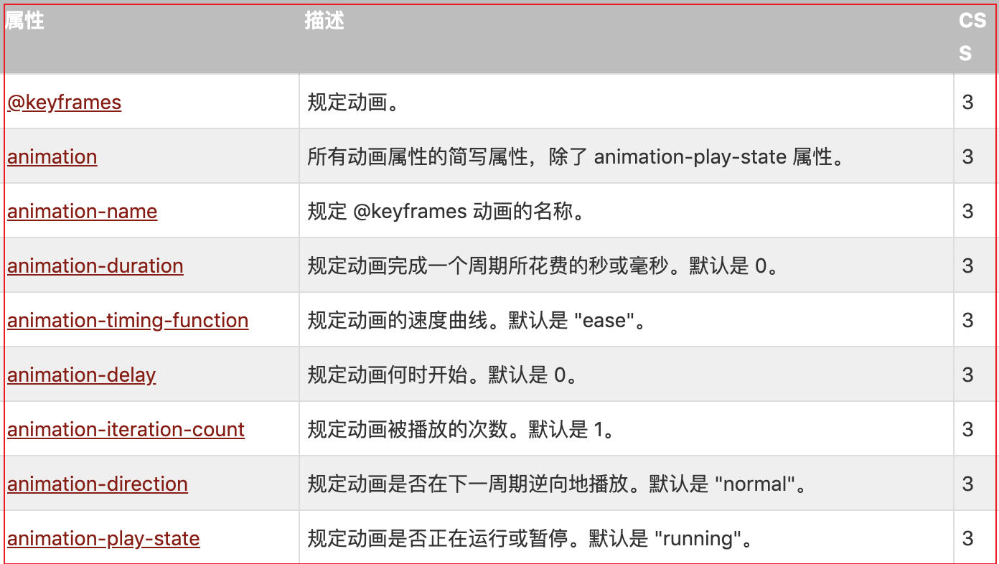

# 1 过渡

- 过渡：是元素从一种样式逐渐改变为另一种的效果；从开始位置到结束位置之间的效果。
- 背景：在 CSS3 引入 transition 之前 css 没有时间轴，所有的状态变化都是瞬间完成
- 作用：transition 的作用在于指定状态变化所需要的时间
- 要素：
  - 指定要添加效果的 CSS 属性
  - 指定效果的持续时间。
- 注意：如果未指定的期限，transition 将没有任何效果，因为默认值是 0
- 语法：
  - `transition-property`: 设置哪些属性参与过渡效果 默认值 all。
  - `transition-duration`: 定义过渡效果花费的时间。默认是 0。
  - `transition-timing-function`: 设置过渡速度类型。默认是 "ease"。
  - `transition-delay`: 规定过渡效果延迟多久后开始。默认是 0。
- 简写：`transition: property duration timing-function delay;`

```html
<!-- 示例1： -->
<style type="text/css">
  .one {
    width: 100px;
    height: 100px;
    background: red;
    margin: 100px auto;
  }
  .one:hover {
    background: rgb(95, 155, 6);
    width: 300px;
    height: 300px;
    /* 设置属性参与过渡：设置width和height属性参与过渡， */
    transition-property: width height;
    /* 默认all 所有属性参与过渡 */
    /* transition-property: all; */

    /* 只有width属性参与过渡效果，height会瞬间到达300px */
    /* transition-property: width; */

    /* 设置过渡时间 */
    transition-duration: 3s;

    /* 设置延迟10s后再开始过渡 */
    transition-delay: 10s;

    /* 设置过渡速度类型 */
    transition-timing-function: ease;
  }
</style>

<div class="one"></div>
```

# 2 动画

- 动画: 使元素从一种样式逐渐变化为另一种样式的效果
- 注意：如果使用百分比，百分比是相对于整个动画执行时间的
- 注意：动画每个阶段偏移的位置坐标不是相对于上一次位置坐标，而是针对动画最开始的坐标
- 简写：简写注意两个时间前面的时间永远便是动画时间  延迟时间在后
```css
/* @keyframes duration | timing-function | delay | iteration-count | direction | fill-mode | play-state | name */
animation: 3s ease-in 1s 2 reverse both paused slidein;
```
- 开始和结束：用百分比来规定变化发生的时间，或用关键词 "from" 和 "to"，等同于 0% 和 100%。
  

```js
// 语法
1. animation-direction：指示动画是否反向播放
    - animation-direction = normal | reverse | alternate | alternate-reverse
    - normal：每个动画循环结束，动画重置到起点重新开始，这是默认属性
    - alternate：从开始点正常运行到结束点，再从结束点慢慢倒退到开始点同时，带时间功能的函数也反向
    - reverse：跳过开始点直接到达结束点，然后从结束点回退到开始点
    - alternate-reverse：动画第一次运行时是反向的，后面恢复成alternate属性
2. animation-fill-mode：设置CSS动画在执行之前和之后如何将样式应用于其目标。
    - none：默认值，回到动画没开始时的状态
    - forwards：让动画停留在结束状态
    - backwards：让动画回到第一帧的状态
    - both: 根据animation-direction（见后）轮流应用forwards和backwards规则
3. animation-play-state：动画播放过程中，会突然停止。这时，默认行为是跳回到动画的开始状态，如果想让动画保持突然终止时的状态，就要使用animation-play-state属性
    - animation-play-state: paused;
    - animation-play-state: running;
```

```html
<!-- /* 示例1：*/ -->
<style type="text/css">
  body {
    perspective: 1000px;
  }
  .box {
    width: 0px;
    height: 0px;
    border-top: 100px solid red;
    border-bottom: 100px solid green;
    border-left: 100px solid blue;
    border-right: 100px solid black;
    border-radius: 50%;
  }

  /* 1. 定义动画集 */
  @keyframes myAnimation {
    /* 下面的百分比表示动画的过程状态点，每个状态点需要进行操作写在对应的状态点内 */
    /* 动画开始0% == from  ||  动画结束100% == to */
    /* 备注：这里动画的每次位移操作是相对于最开始原点移动，而不是相对于上次的位置 */
    from {
      transform: translateX(0px);
    }
    25% {
      transform: translateX(200px);
    }
    50% {
      transform: translate(200px, 200px);
    }
    75% {
      transform: translateY(200px);
    }
    to {
      transform: translate3d(0px, 200px, -200px);
    }
  }

  .box {
    /* 设置动画名称：哪个选择器需要就把动画名称设置到指定选择器 */
    animation-name: myAnimation;

    /*  设置动画时间 */
    animation-duration: 10s;

    /*  设置动画延迟 */
    animation-delay: 2s;

    /* 设置动画速度曲线 linear匀速 ease默认*/
    animation-timing-function: linear;

    /* 设置动画执行次数   infinite无限执行*/
    animation-iteration-count: 1;

    /* 设置动画在下一周期是否逆向播放  alternate逆向播放 */
    animation-direction: alternate;

    /* 设置动画结束时的状态  从开始到结束点会自动暂停，最后一个关键帧取决于 animation-iteration-count不能为无限次*/
    /* animation-fill-mode: forwards; */
  }
  .box:hover {
    /* 定义一个动画是否运行或者暂停  animation-play-state: paused | running*/
    animation-play-state: paused;
  }
</style>
<div class="box"></div>
```
