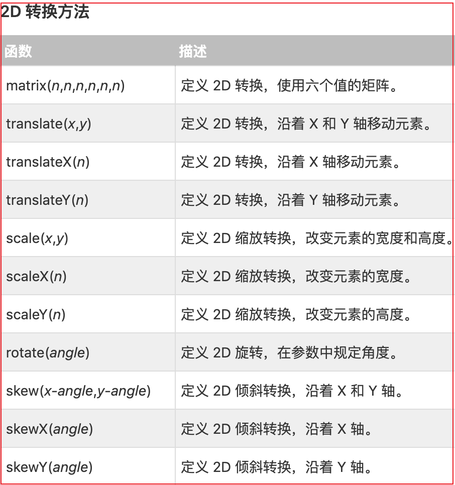
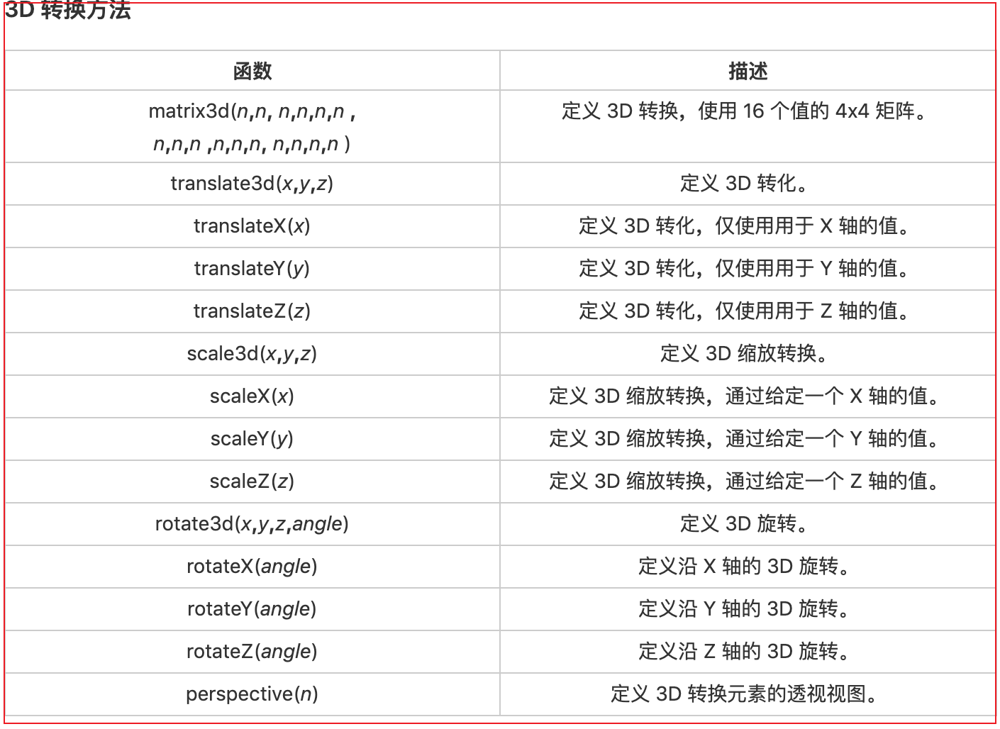

# 2D 转换

- 注意点： 每次操作都是针对最开始的状态进行操作的

```css
/* 示例1： 表示将盒子从先x平移200，再向下平移200，再左移200，再在z轴向上200 */
0% { transform: translateX(0px); } 
25% { transform: translateX(200px); } 
50% { transform: translate(200px, 200px); } 
75% { transform: translateY(200px); } 
100% { transform: translateZ(200px); }
```

# 1 位移

- `translate(x, y)`: 根据左(X 轴)和顶部(Y 轴)位置给定的参数，从当前元素位置移动。
- 备注：这里位移指的是相对于元素自身开始位移

```html
<!-- 示例1： -->
<style type="text/css">
  .box {
    height: 300px;
    background: pink;
  }
  .one {
    width: 100px;
    height: 100px;
    background: red;
    /* translate(x, y) 位移到指定位置； 备注：这里位移指的是以元素自身为原点00 */
    transform: translate(100px, 100px);
  }
</style>
<div class="box">
  <div class="one"></div>
</div>
```

# 2 旋转

- `transform: rotate(度数)`：旋转多少度；正度数顺时针；负度数逆时针

```css
/* 示例1： */
/* rotate(30deg) 参数为旋转度数，正度数顺时针，负度数逆时针 */
transform: rotate(30deg);
```

# 3 缩放

- `transform: scale(0.5, 1);`: 里面的参数是倍数
- 缩放：设置倍数大于 0 小于 1
- 放大：设置倍数大于 1

```css
/* 示例1： */
/* 缩放倍数; 一个参数表示整体缩放0.5倍； */
transform: scale(0.5);

/* 两个参数表示width缩放和height缩放, scale(0.5, 1) 表示宽缩放一半，高不变 */
transform: scale(0.5, 1);
```

# 4 倾斜

- `transform: skew(30deg, 30deg)`: skew(x 倾斜度数, y 倾斜度数) 分别沿 x 和 y 轴倾斜度数
- 如果第二个参数为空，则默认为 0，参数为负表示向相反方向倾斜
- `skewX( )`: 表示只在 X 轴(水平方向)倾斜。
- `skewY( )`: 表示只在 Y 轴(垂直方向)倾斜。

```css
/* 示例1： */
/* skew(x倾斜度数, y倾斜度数)  分别沿x和y轴倾斜度数*/
transform: skew(30deg, 30deg);
```

# 5 2d 方法



# 3D 转换

- 位移
- 旋转
- 缩放
- 倾斜
  

# perspective 透视效果

- perspective 是给父元素加的，指定观察者距平面的距离，这时候子元素再在 z 轴操作
- 指定了观察者与 z=0 平面的距离，使具有三维位置变换的元素产生透视效果。 z>0 的三维元素比正常大，而 z<0 时则比正常小，大小程度由该属性的值决定
- perspective 属性只影响 3D 转换元素。
- 语法：`perspective: number|none;`
  - number: 元素距离视图的距离，以像素计。
  - none: 默认值。与 0 相同。不设置透视。

```html
<!-- 示例1： -->
<style type="text/css">
  .box {
    height: 300px;
    background: pink;
    /* 透视：指定观察者距平面的距离 */
    perspective: 1000px;
    border: 1px solid pink;
  }
  .one {
    width: 100px;
    height: 100px;
    background: red;
    margin: 100px auto;
  }
  .one:hover {
    /* 视觉上：500px放大 -500px缩小 */
    transform: translateZ(500px);
  }
</style>
<div class="box">
  <div class="one"></div>
</div>
```

# transform-style

- `transform-style`: 设置元素的子元素是位于 3D 空间中还是平面中
- 语法：`transform-style = flat | preserve-3d`
  - flat: 设置元素的子元素位于该元素的平面中。
  - preserve-3d: 指示元素的子元素应位于 3D 空间中。
